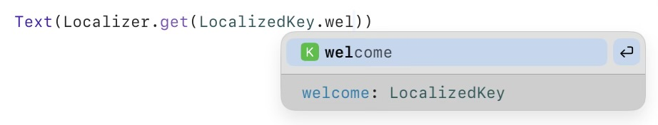

<!-- Logo first -->
<p align="center">
  
</p>

<h1 align="center">LocalizerKit</h1>

<p align="center">
  <a href="https://swift.org">
    
  </a>
  <a href="https://swiftpackageindex.com/SummaCristian/LocalizerKit">
    
  </a>
  <a href="https://github.com/SummaCristian/LocalizerKit/blob/main/LICENSE">
    
  </a>
  
  
</p>

**LocalizerKit** is a Swift Package that provides the foundation to localize your apps built in Swift Playground.

While Swift Playground is the main target, since it lacks native localization support unlike Xcode, **this package works in any Swift project**.

## 🚀 Usage

First, import the package wherever you need it:

```swift
import LocalizerKit
```

### 🗝️ Creating the keyset for your strings
This package relies on an enum to define the keys used for localized strings.
This improves autocomplete, avoids typos, and makes the code easier to maintain.

Your keyset should conform to `LocalizedKeyProtocol`, and also be `RawRepresentable` with `String` and `Hashable`.

``` swift
enum LocalizedKey: String, LocalizedKeyProtocol {
    case welcome
    case goodbye
    // ...
}
```

#### 🧠 Why use an enum for keys?
LocalizerKit ensures your keys are compiler-checked. If you reference a missing key, your code won’t compile — no more runtime crashes due to typos.
Plus, the IDE autocompletes your keys automatically, making localization fast, safe, and efficient.

<p align="center">
  <picture>
    <source srcset="Assets/AutocompletePreview_Dark.jpeg" media="(prefers-color-scheme: dark)">
    <source srcset="Assets/AutocompletePreview_Light.jpeg" media="(prefers-color-scheme: light)">
    
  </picture>
</p>

### 📝 Defining localized strings
To define the actual strings, create one struct per supported language, conforming to `LocalizedLanguage`.
Each struct must:
- Specify its `SupportedLanguage` (e.g. `.en`, `.it`)
- Provide a `dictionary` mapping keys to strings

``` swift
struct EnglishStrings: LocalizedLanguage {
    static let language: SupportedLanguage = .en
    static let strings: [LocalizedKey: String] = [
        .welcome: "Welcome",
        .goodbye: "Goodbye"
    ]
}
```

💡 Tip: While LocalizerKit supports different keysets per language, it’s highly recommended to use a shared one for consistency and easier maintenance.

### 🔌 Registering localizations
You must register each language’s struct so that Localizer knows where to look.

You can do this automatically using a SwiftUI view modifier:

``` swift
WindowGroup {
    ContentView()
        .localized(in: [EnglishStrings.self, ItalianStrings.self, GermanStrings.self])
}
```

This modifier registers each language into `LocalizerRegistry`, using the language specified in each struct.

⚠️ If multiple structs register for the same language, the last one will overwrite the previous entry.

### 🧩 Manual registration (advanced use)
You can skip the view modifier and register manually.
For example, in your `init()`:

``` swift
init() {
    let languages = [EnglishStrings.self, ItalianStrings.self, GermanStrings.self]

    for language in languages {
        LocalizerRegistry.register(language)
    }
}
```

### 🌍 Language resolution and overrides
By default, LocalizerKit uses the first language from `Locale.preferredLanguages` that is also registered in `LocalizerRegistry`.

You can override this behavior with `LocalizerSettings`:
``` swift
@StateObject private var settings = LocalizerSettings()

Toggle("Override system language", isOn: $settings.overrideSystemLanguages)

Picker("Language", selection: $settings.selectedLanguage) {
    ForEach(Localizer.availableLanguages, id: \.self) { lang in
        Text("\(lang.flag) \(lang.displayName)").tag(lang)
    }
}
```

The `Localizer` struct exposes two variables you can tinker with:
- `.overrideSystemLanguages`: a `Bool` that, when set `true`, makes `Localizer` ignore the system's `Locale.preferredLanguages`
- `.selectedLanguage`: a `SupportedLanguage` value that defines the app's language when override is enabled

When `Localizer.overrideSystemLanguages` is `true`, all localization lookups will use `.selectedLanguage` instead of the system locale.
This makes it easy to detach your app’s language from the device’s settings, ideal for providing an in-app language picker for example.

### 🖥️ Using localized strings in views
Once set up, retrieving a localized string is simple:

``` swift
Text(Localizer.get(LocalizedKey.welcome))
```

### 💡 Cleaner syntax with extension
To avoid writing `LocalizedKey.` every time, add this helper:

``` swift
extension Localizer {
    public static func get(
      _ key: LocalizedKey,
      in lang: SupportedLanguage = Localizer.currentLanguage
    ) -> String {
        return get(key as any LocalizedKeyProtocol, in: lang)
    }
}
```

Then use:

``` swift
Text(Localizer.get(.welcome))
```

You can locally override the language in a specific Text:
``` swift
Text(Localizer.get(.welcome, in: .fr))
```

### 🌍 Adding a new localization
To add support for a new language:
1. Create a struct for the new language (e.g. `SpanishStrings`), implementing `LocalizedLanguage`.
2. Add it to the `.localized(in: [...])` modifier or manually register it.

Done! The app will now automatically use that language if it matches the user’s preferred locale.

### 🌐 Supported Languages
LocalizerKit currently includes out-of-the-box translations for 30 languages, and growing. 
You can register just the ones you need for your app, no need to rush all of them at launch.

Supported languages include:
### 🌐 Supported Languages

|        |        |        |
|--------|--------|--------|
| 🇺🇸 English | 🇮🇹 Italian | 🇫🇷 French |
| 🇩🇪 German | 🇪🇸 Spanish | 🇵🇹 Portuguese |
| 🇳🇱 Dutch | 🇸🇪 Swedish | 🇩🇰 Danish |
| 🇫🇮 Finnish | 🇵🇱 Polish | 🇨🇿 Czech |
| 🇷🇴 Romanian | 🇭🇺 Hungarian | 🇬🇷 Greek |
| 🇹🇷 Turkish | 🇷🇺 Russian | 🇺🇦 Ukrainian |
| 🇮🇱 Hebrew | 🇸🇦 Arabic | 🇮🇳 Hindi |
| 🇨🇳 Chinese | 🇯🇵 Japanese | 🇰🇷 Korean |
| 🇻🇳 Vietnamese | 🇹🇭 Thai | 🇮🇩 Indonesian |
| 🇲🇾 Malay | 🇳🇴 Norwegian | 🇮🇷 Persian |

## 📦 Installation
To use LocalizerKit in your project:
1. Open Swift Playground or Xcode.
2. Add a Swift Package dependency with this URL:
```
https://github.com/SummaCristian/LocalizerKit.git
```
3. Import the module in your files:
```swift
import LocalizerKit
```

## 📄 License
LocalizerKit is released under the MIT License.
See the LICENSE file for more details.
